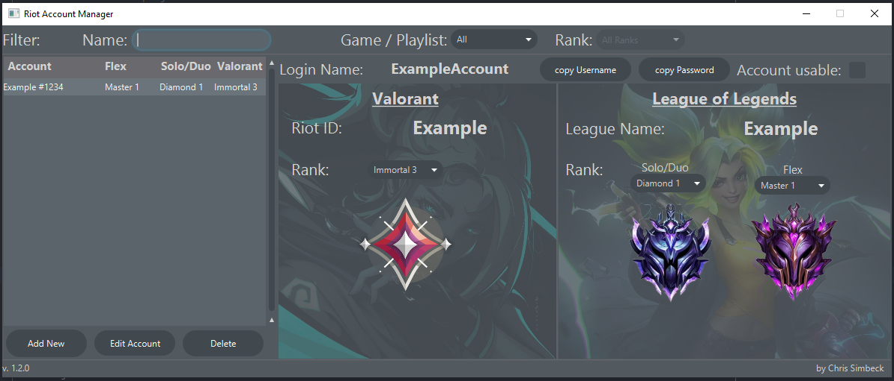

# RiotAccountManager

## Description:

A managing tool to keep track of all your League and Valorant Accounts and their Ranks. 
It should help you to find the account you need so you dont have to remember all passwords or store them into a unsecure .txt file. ;D
Just be sure you have the "RiotAccountManager.jar" in the same fodler as the "League_rank_pictures" and the "Valorant_rank_pictures", to not cause any issues

Features:
- Filter by Rank or Accountnames
- Save the League and Valorant Ranks
- keep you Accounts organized and save

## Screenshots

## Installation

Version 2.0.0
[Download](https://github.com/Pantastix/RiotAccountManager/releases/download/v2.0.0/RiotAccountManager.rar)

## Updates

In case your installing a new version, you can just copy the SaveState.Json into the Json folder of the new copy.
Same if you want to transfer your save to a new machine.

## Security and Encryption

The save files are encrypted with AES-256, to keep you data save.

## Troubleshooting

If you find any Problems or Bugs, please let me know.
you fins my contact information in my GitHub Profile.

## Disclaimer

This is a Fan made product and does not reflect the opinions of Riot games.
The character's in the social preview fully belongs to riot games and their products, as well as some parts of the Logo.

## Author
[@Chris Simbeck](https://github.com/Pantastix)

with the help of 
[@Flaxel](https://github.com/flaxel)
