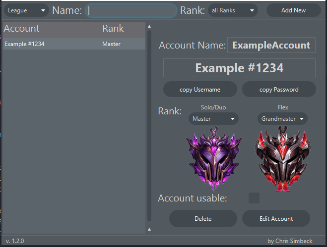
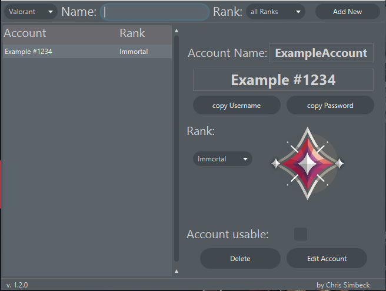

# RiotAccountManager

## Description:

A managing tool to keep track of all your League and Valorant Accounts and their Ranks. 
You can easily switch between League of Legends and Valorant and store multiple Accounts. 
It should help you to find the account you need so you dont have to remember all passwords or store them into a unsecure .txt file. ;D
Just be sure you have the "RiotAccountManager.jar" in the same fodler as the "League_rank_pictures" and the "Valorant_rank_pictures", to not cause any issues

Features:
- Filter by Rank or Accountnames
- Save the League and Valorant Ranks

upcomming features:
- more detailed Ranks
- better League support

## Screenshots

 

## Installation

Version 1.1.0
[Downlaod](https://github.com/Pantastix/RiotAccountManager/releases/download/v1.1.0/RiotAccountManager.rar)

## Updates

In case your installing a new version, you can just copy the SaveState.Json into the Json folder of the new copy.
But if you want to transfer your save to a new machine, you can simply copy the SaveState.json into the Json folder of the new Application.

## Security and Encryption

The save files are encrypted with AES-256, to keep you data save.

## Troubleshooting

in case the following error occures: 
<em>"Error: A JNI error has occured. please check your installation and try again"</em> 

[Follow this tutorial for a fix](https://www.youtube.com/watch?v=cRgLuNWCq6c)
(3min)

## Disclaimer

This is a Fan made product and does not reflect the opinions of Riot games.
The character's in the social preview fully belongs to riot games and their products, as well as some parts of the Logo.

## Author
[@Chris Simbeck](https://github.com/Pantastix)

with the help of 
[@flaxel](https://github.com/flaxel)
